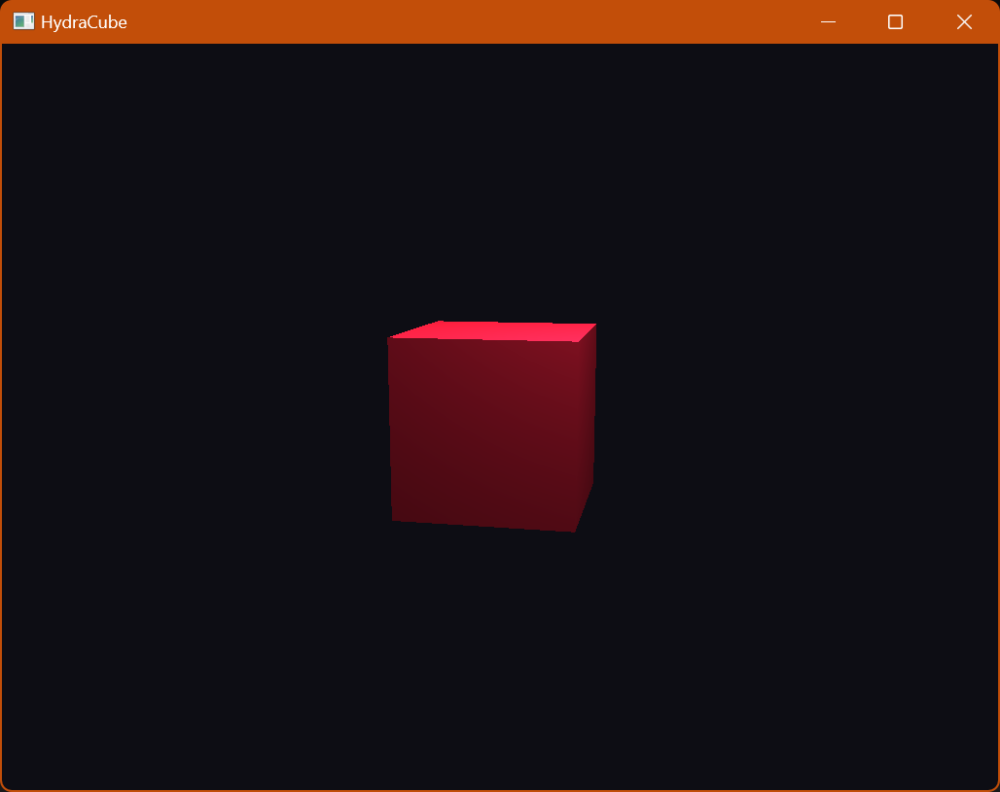

# HydraCube
Draw a red cube with Hydra.

# Building
Only tested on windows.
 * This repository has submodules so make sure you use `--recurse` during `git clone`.
 * Start a visual studio command prompt.
 * Run hc.py
   * This will build usd debug configuration.
   * Generate HydraCube.sln in `out/vs-win-amd64` folder.
 * Open `out/vs-win-amd64/HydraCube.sln` and run the HydraCube in Debug configuration.

# Cube

